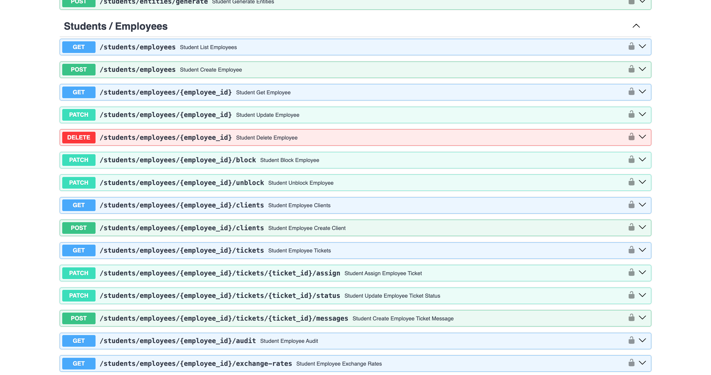
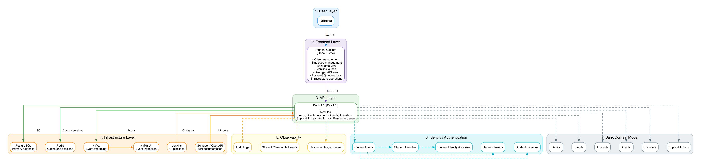
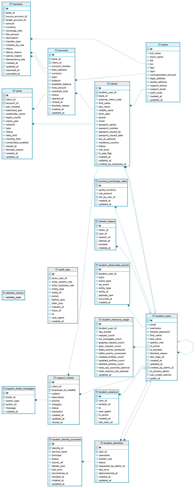

# EasyITLab Bank

EasyBank is an open-source educational banking platform designed for learning QA automation, API testing, DevTools debugging, and microservice testing in a realistic environment.

It provides a fully working backend system with CI/CD, event streaming, database, and observability tools that can be run locally with Docker.


## Table of Contents

- [Overview](#overview)
- [Project Goals](#project-goals)
- [Features](#features)
- [Screenshots](#screenshots)
- [Demo](#demo)
- [Architecture](#architecture)
- [Project Structure](#project-structure)
- [Tools](#tools)
- [Database Schema](#database-schema)
- [Requirements](#requirements)
- [Quick Start](#quick-start)
- [Make Commands](#make-commands)
- [API](#api)
- [Running Tests](#running-tests)
- [Learning Scenarios](#learning-scenarios)
- [Example Use Cases](#example-use-cases)
- [Roadmap](#roadmap)
- [FAQ](#faq)
- [Online Services](#online-services)
- [Contributing](#contributing)
- [License](#license)
- [Credits](#credits)
- [Star History](#star-history)

## Overview

EasyITLab Bank is a microservice-based training platform where students can practice against a realistic banking domain:

- clients and employees
- accounts, cards, transfers
- support tickets
- auth/identity/session workflows
- event-driven processing and CI

## Project Goals

This project was created to provide a realistic backend environment for learning:

- QA automation
- API testing
- DevTools debugging
- CI/CD workflows
- distributed systems testing

Instead of learning tools in isolation, students can practice on a real microservice-style system.

## Features

- realistic banking entities and workflows
- student-oriented web cabinet
- REST API with OpenAPI/Swagger contract
- Jenkins + Allure training flow
- PostgreSQL, Redis, and Kafka integration
- observable events, audit logs, and usage tracking

## Screenshots

Click any preview to open full size.

| Dashboard | Clients |
| --- | --- |
| [](docs/screenshots/dashboard.png) | [](docs/screenshots/clients.png) |

| API | API (Alt 1) |
| --- | --- |
| [](docs/screenshots/api.png) | [](docs/screenshots/api_2.png) |

## Demo

| Demo | GIF |
| --- | --- |
| Platform walkthrough | [](docs/demo/demo.gif) |
| Jenkins | `docs/demo/jenkins.gif` |
| Allure | `docs/demo/allure.gif` |
| PostgreSQL | `docs/demo/postgresql.gif` |
| Redis | `docs/demo/redis.gif` |
| Kafka | `docs/demo/kafka.gif` |
| REST API / Swagger | `docs/demo/swagger.gif` |

## Architecture

EasyITLab Bank is a containerized microservice-style platform built for education.

Core components:

- Student Cabinet (React + Vite)
- API Gateway + FastAPI services
- PostgreSQL for transactional storage
- Redis for fast transient state
- Kafka for asynchronous events
- Jenkins + Allure for CI/test reporting

The platform runs locally with Docker and can be started with `make` commands.

[](docs/architecture/bank_architecture.png)

Architecture source files:

- [docs/architecture/bank_architecture.drawio](docs/architecture/bank_architecture.drawio)
- [docs/architecture/README.md](docs/architecture/README.md)

## Project Structure

```text
bank-open-source
├── .github/
├── docs/
│   ├── architecture/
│   ├── demo/
│   ├── screenshots/
│   └── db_schema.puml
├── frontends/
│   └── cabinet/
├── infra/
│   ├── gateway/
│   ├── jenkins/
│   ├── kafka/
│   └── postgres/
├── services/
│   ├── api-gateway/
│   ├── auth-service/
│   ├── bank-api/
│   └── common/
├── docker-compose.yml
└── Makefile
```

## Tools

This project includes six operational tools as first-class learning components.

### Jenkins

Jenkins runs reproducible CI jobs from user-provided test repositories.
By default, tests are pulled from: `https://github.com/danilfg/bank-open-source-tests`.
You can start bank services with Docker, clone your own test repository, and run your own tests in the Jenkins job.

Current metrics:

- preconfigured training jobs: `1` (`training-github-allure`)
- supported parameters: repository URL, branch, test command

GIF: `docs/demo/jenkins.gif`

### Allure

Allure transforms raw test results into readable test analytics.
In this project, Allure report artifacts are generated from Jenkins builds.

Current metrics:

- default report generation flow: `1` Jenkins training job
- report artifact path pattern: `/job/<job>/<build>/artifact/allure-report/index.html`

GIF: `docs/demo/allure.gif`

### PostgreSQL

PostgreSQL is the primary transactional database for domain and identity data.

Current metrics:

- public tables in local database: `17` (including migration table)
- domain entities in `docs/db_schema.puml`: `16`
- default database name: `demobank`

GIF: `docs/demo/postgresql.gif`

### Redis

Redis is used for cache-like/transient state, session-adjacent data, and coordination locks.

Current metrics:

- configured logical Redis databases: `16`
- database used by services: `0` (`redis://redis:6379/0`)

GIF: `docs/demo/redis.gif`

### Kafka

Kafka is used as the event backbone for asynchronous domain/platform events.

Current metrics:

- platform event topics in codebase: `11`
- topics: `account-events`, `audit-events`, `auth-events`, `bank-events`, `card-events`, `client-events`, `iam-events`, `student-events`, `support-events`, `transfer-events`, `usage-events`

GIF: `docs/demo/kafka.gif`

### REST API / Swagger

Swagger is the live API contract/documentation surface used for endpoint exploration and payload validation.

Current metrics (aggregated gateway OpenAPI):

- API paths: `81`
- HTTP methods/operations: `97`
- student-scoped paths: `31`
- student-scoped operations: `37`

GIF: `docs/demo/swagger.gif`

## Database Schema

Database schema diagram from docs. Click the image to open full size.

[](docs/db-schema.png)

Source files:

- PlantUML source: [docs/db_schema.puml](docs/db_schema.puml)
- GraphML source: [docs/db-schema.graphml](docs/db-schema.graphml)

## Requirements

- Docker 24+ (recommended)
- Docker Compose plugin
- GNU Make
- Recommended minimum resources: `4 GB RAM`, `2 CPU cores`

## Quick Start

Clone repository:

```bash
git clone https://github.com/danilfg/bank-open-source.git
cd bank-open-source
```

Start platform:

```bash
make up
make migrate
make seed
```

Open in browser:

- Student Cabinet: `http://127.0.0.1:5174/`
- Swagger: `http://127.0.0.1:8080/docs`
- Jenkins: `http://127.0.0.1:8086/`

Default student credentials:

- Email: `student@easyitlab.tech`
- Password: `student123`

## Make Commands

All available `make` targets in this repository:

| Command | What it does |
| --- | --- |
| `make ensure-env` | Creates `.env` from `.env.example` if `.env` is missing. |
| `make up` | Starts all services with Docker Compose (`up -d --build`). |
| `make down` | Stops services and removes volumes (`down -v`). |
| `make logs` | Streams service logs (`logs -f --tail=200`). |
| `make ps` | Shows current container status. |
| `make build` | Builds/rebuilds service images. |
| `make migrate` | Applies Alembic migrations in `bank-api`. |
| `make seed` | Alias to `seed-rich`; seeds demo/training data. |
| `make seed-rich` | Runs `scripts/seed_data.py` in `bank-api`. |
| `make reseed-clean` | Full reset: `down` -> `up` -> `seed`. |
| `make lint` | Runs `ruff check .` inside `bank-api`. |
| `make demo-test` | Runs demo API tests (`pytest -q tests/api`). |
| `make test` | Runs full pytest suite (`pytest -q`). |

Typical local flow:

```bash
make up
make migrate
make seed
make test
```

## API

Base URL examples:

- Local: `http://127.0.0.1:8080`
- Cloud example: `https://api.bank.easyitlab.tech`

Example login request:

```http
POST /auth/login
Content-Type: application/json

{
  "email": "student@easyitlab.tech",
  "password": "student123"
}
```

## Running Tests

Run demo API tests:

```bash
make demo-test
```

Run full test suite:

```bash
make test
```

## Learning Scenarios

This platform can be used for practicing:

- manual API exploration with Swagger and request/response validation
- automated API tests with pytest and Allure report generation
- CI flows with Jenkins jobs and build artifacts
- database testing with PostgreSQL queries and migration checks
- event-driven flows with Kafka and asynchronous processing checks
- debugging with browser DevTools, logs, and observable events

## Example Use Cases

### QA Engineers

- learn API automation patterns
- practice writing and stabilizing pytest suites

### Backend Developers

- experiment with service boundaries and integrations
- validate behavior under async/event-driven flows

### Students

- practice debugging real backend workflows
- move from toy examples to production-style system behavior

### Mentors and Instructors

- build practical assignments on top of real services
- evaluate student work with repeatable CI pipelines

## Roadmap

See detailed roadmap in [ROADMAP.md](ROADMAP.md).

Planned directions:

- richer UI testing scenarios (e.g. Playwright-based tasks)
- observability expansion (dashboards, tracing, diagnostics)
- stronger deployment templates for cloud/Kubernetes practice
- more integrations for QA and backend education workflows

## FAQ

### Why is this project source-available and not fully open source?

The platform is free for education, personal use, and research. Commercial use is restricted. See [LICENSE](LICENSE) and [COMMERCIAL_LICENSE.md](COMMERCIAL_LICENSE.md).

### Can I run my own tests instead of default ones?

Yes. Use your own repository URL/branch in Jenkins training job parameters.

### How do I reset the environment completely?

Use:

```bash
make reseed-clean
```

## Online Services

Main website:

- https://easyitlab.tech/

Cloud version (full functionality):

- https://bank.easyitlab.tech/

Community Telegram:

- https://t.me/danilfg

## Contributing

Contributions are welcome.

See [CONTRIBUTING.md](CONTRIBUTING.md).

## License

This project is source-available.

Free for:

- education
- personal use
- research

Commercial use is prohibited.

See [LICENSE](LICENSE).

## Credits

Created by EasyITLab / Daniil Nikolaev.

## Star History

[](https://www.star-history.com/#danilfg/bank-open-source&Date)

If this project helps you learn testing or automation, please give it a star.
