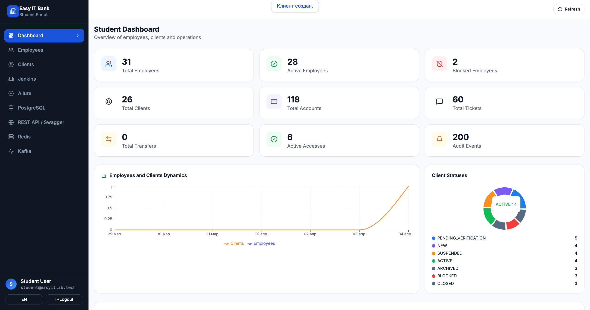
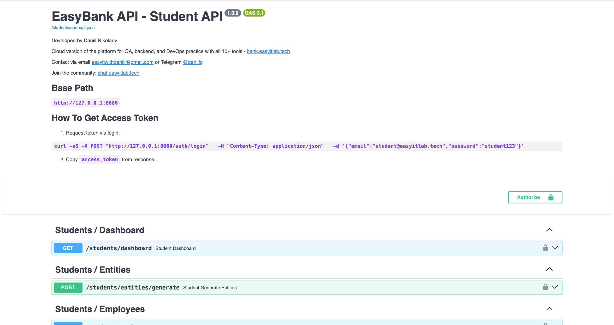

# EasyITLab Bank


Educational banking platform for learning:

- API testing
- automation testing
- DevTools debugging
- microservice testing

## Screenshots





## Demo


## Features

- realistic banking entities
- student environment
- REST API
- Swagger documentation
- testing playground

## Quick Start

Clone repository:

```bash
git clone https://github.com/danilfg/bank-open-source.git
```

Enter project folder:

```bash
cd bank-open-source
```

Run with Docker:

```bash
docker compose up
```

## API

Example base API:

```text
https://api.bank.easyitlab.tech
```

Example login request:

```text
POST /auth/login
```

## Online Services

Main website:

https://easyitlab.tech/

Cloud version (full functionality):

https://bank.easyitlab.tech/

Community Telegram:

https://t.me/danilfg

## Why this project exists

This platform helps developers learn:

- QA automation
- API testing
- DevTools
- backend debugging

## Contributing

Contributions are welcome.

See [CONTRIBUTING.md](CONTRIBUTING.md).

## License

This project is source-available.

Free for:

- education
- personal use
- research

Commercial use is prohibited.

See [LICENSE](LICENSE).

If this project helps you, please consider giving it a star on GitHub.
